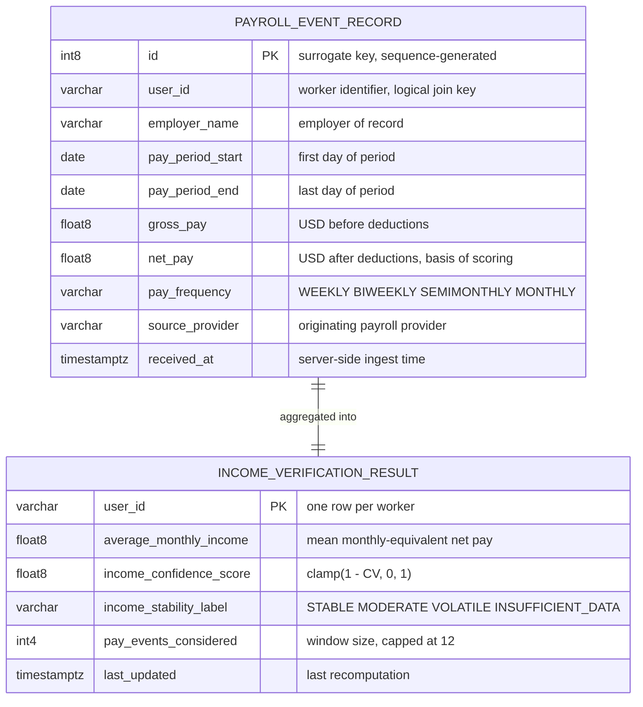
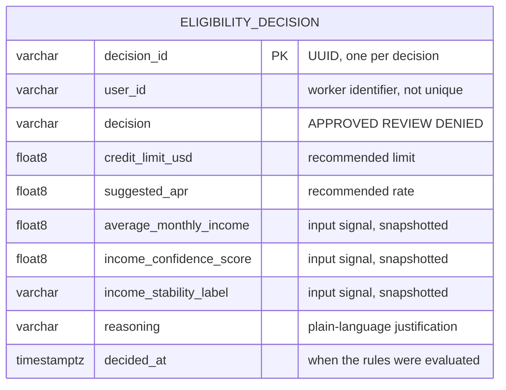
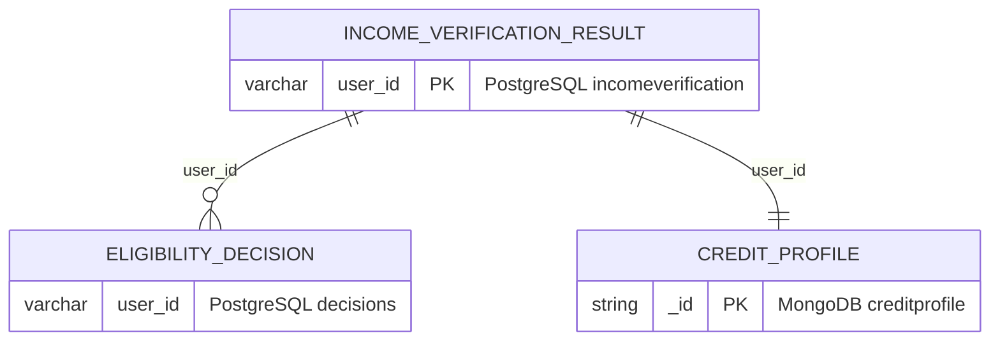
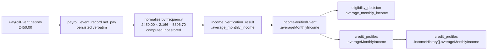

# Data Model

Physical data model for the Payroll-Integrated Real-Time Credit
Infrastructure: entity relationships, explicit DDL, field-level semantics,
data lineage through the pipeline, and privacy classification.

Section 6 of the System Architecture Document summarises the same structures
in tabular form. This document is the detailed reference — it adds the
relationship diagrams, the executable DDL, the lineage trace, and the
regulatory classification of each field.

| Section | Contents |
|---|---|
| [1. Store topology](#1--store-topology) | Which service owns which database, and why |
| [2. Entity relationships](#2--entity-relationships) | ER diagrams per database |
| [3. Explicit DDL](#3--explicit-ddl) | The relational schema as SQL |
| [4. Document schema](#4--document-schema) | MongoDB structure and validator |
| [5. Data dictionary](#5--data-dictionary) | Field-level meaning, not just type |
| [6. Data lineage](#6--data-lineage) | How one value travels the pipeline |
| [7. Privacy classification](#7--privacy-classification) | GLBA, CCPA, FCRA exposure |
| [8. Known gaps](#8--known-gaps) | Indexes, constraints, retention |

---

## 1 — Store topology

Three logical databases across two engines. Each is owned by exactly one
service; no service reads another service's tables.

| Database | Engine | Owning service | Contents |
|---|---|---|---|
| `incomeverification` | PostgreSQL 16 | income-verification-service | Raw pay events and the current income assessment |
| `decisions` | PostgreSQL 16 | decision-service | Append-only eligibility decision audit trail |
| `creditprofile` | MongoDB 7 | credit-profile-service | Aggregate profile documents |

**Why the split.** Service ownership of schema is what makes the services
independently deployable. If the decision service read
`income_verification_result` directly, a column rename in the income service
would break it, and the two would have to be released together. Instead the
contract between them is the `income.verified` Kafka event, which is versioned
and explicit.

**Why two engines.** The relational stores hold records whose shape is fixed
and whose integrity matters — an audit row must have exactly the columns it
has, and must not change. The profile document holds an evolving aggregate
that will accumulate new signal categories over time (bank cash flow, rent
reporting, employment tenure). Adding a field to a document requires no
migration; adding one to an audit table does. The choice follows the shape of
the data rather than a top-down mandate.

---

## 2 — Entity relationships

### `incomeverification` database



The relationship is computed, not declarative. There is no foreign key: the
result row is derived by aggregating event rows sharing a `user_id`, and is
recomputed in full on every new event rather than incrementally maintained.

### `decisions` database



A single table, deliberately. Note that `user_id` is **not** unique: a worker
accumulates one row per assessment. The most recent decision is the row with
the greatest `decided_at` for that `user_id`.

The three input signal columns are denormalised copies of values that also
exist in `income_verification_result`. This is intentional and load-bearing —
see [section 6](#6--data-lineage).

### Cross-database relationship



`user_id` is the join key across all three stores, but the relationship is
**logical only**. No foreign key exists, and none could — the stores are
separate databases on two different engines. Referential integrity across
service boundaries is maintained by the event flow, not by the database.

This is a deliberate trade of enforced integrity for independent
deployability. The consequence is real and should be stated plainly: it is
possible for a decision row to exist for a `user_id` that has no
corresponding profile document, if the credit profile service was down when
the event was published. Kafka's retention means the consumer catches up when
it restarts, so the window is bounded, but it is not zero.

---

## 3 — Explicit DDL

The relational schema is currently generated by Hibernate from the JPA entity
classes. Generated schema is convenient during development but implicit — it
is not visible in the repository, and it changes when an annotation changes.

The DDL below is generated from those files by `sync-ddl.sh` and quoted here
so that a reader browsing on GitHub does not have to click through. The files
are the source of truth; this is a quotation of them, and comment annotations
are stripped when inlining.

<!-- BEGIN-DDL: schema/incomeverification.sql -->
```sql
-- source: schema/incomeverification.sql
-- annotations omitted here; see the file for full commentary

CREATE TABLE payroll_event_record (
    id                BIGSERIAL                     PRIMARY KEY,
    employer_name     VARCHAR(255),
    gross_pay         DOUBLE PRECISION              NOT NULL,
    net_pay           DOUBLE PRECISION              NOT NULL,
    pay_frequency     VARCHAR(255),
    pay_period_end    DATE                          NOT NULL,
    pay_period_start  DATE                          NOT NULL,
    received_at       TIMESTAMP(6) WITH TIME ZONE   NOT NULL,
    source_provider   VARCHAR(255),
    user_id           VARCHAR(255)                  NOT NULL
);

CREATE TABLE income_verification_result (
    user_id                  VARCHAR(255)                  PRIMARY KEY,
    average_monthly_income   DOUBLE PRECISION              NOT NULL,
    income_confidence_score  DOUBLE PRECISION              NOT NULL,
    income_stability_label   VARCHAR(255)                  NOT NULL,
    last_updated             TIMESTAMP(6) WITH TIME ZONE   NOT NULL,
    pay_events_considered    INTEGER                       NOT NULL
);
```
<!-- END-DDL -->

<!-- BEGIN-DDL: schema/decisions.sql -->
```sql
-- source: schema/decisions.sql
-- annotations omitted here; see the file for full commentary

CREATE TABLE eligibility_decision (
    decision_id              VARCHAR(64)                   PRIMARY KEY,
    average_monthly_income   DOUBLE PRECISION              NOT NULL,
    credit_limit_usd         DOUBLE PRECISION              NOT NULL,
    decided_at               TIMESTAMP(6) WITH TIME ZONE   NOT NULL,
    decision                 VARCHAR(32)                   NOT NULL,
    income_confidence_score  DOUBLE PRECISION              NOT NULL,
    income_stability_label   VARCHAR(255)                  NOT NULL,
    reasoning                VARCHAR(2000)                 NOT NULL,
    suggested_apr            DOUBLE PRECISION              NOT NULL,
    user_id                  VARCHAR(255)                  NOT NULL
);
```
<!-- END-DDL -->

After editing either `.sql` file, run:

```bash
./docs/data-model/sync-ddl.sh
```

To confirm they have not drifted apart without changing anything:

```bash
./docs/data-model/sync-ddl.sh --check
```

### Verification record

| Date | Method | Outcome |
|---|---|---|
| 2026-07-26 | `schema/verify-schema.sh` against the live deployment | Corrected. Four columns had a documented length that did not match, and all three timestamp columns are `timestamp with time zone` rather than plain `timestamp`. No divergence indicated a defect in the application; every discrepancy was an error in this document. |
| 2026-07-26 | Same run, MongoDB section | Corrected. Stored field names are PascalCase, not the camelCase this document had recorded. The validator in `creditprofile.schema.json` would have rejected every existing document had it been applied as originally written. See [section 4](#4--document-schema). |

The DDL above reflects that verification. Two properties of it are artefacts
of Hibernate's generation rather than deliberate design, and are reproduced
faithfully rather than tidied:

- **Column order is alphabetical after the primary key.** It carries no
  meaning, and is itself a signature of generated rather than hand-written
  schema.
- **String columns without an explicit `@Column(length = ...)` default to
  `VARCHAR(255)`**, including the enumerated ones. Three columns do carry an
  explicit length — `decision_id` at 64, `decision` at 32, and `reasoning` at
  2000. The inconsistency is real and is discussed in
  [section 8](#8--known-gaps).

### Verifying this against the live database

Generated DDL and hand-written DDL diverge easily. Confirm before citing this
document:

```bash
./docs/data-model/schema/verify-schema.sh
```

The script dumps the live schema from both databases and prints it for
comparison. If the output differs from the DDL above, the DDL above is wrong
and should be corrected — the database is the source of truth.

---

## 4 — Document schema

### `credit_profiles` collection

A document as actually stored, verified against the live database on
2026-07-26:

```json
{
  "_id": "user-1001",
  "AverageMonthlyIncome": 5306.70,
  "IncomeConfidenceScore": 1.0,
  "IncomeStabilityLabel": "STABLE",
  "PayEventsConsidered": 4,
  "BureauScore": 598,
  "BureauSource": "Experian",
  "ThinFileClassification": "STANDARD",
  "IncomeHistory": [
    {
      "AverageMonthlyIncome": 5306.70,
      "IncomeConfidenceScore": 0.4,
      "IncomeStabilityLabel": "INSUFFICIENT_DATA",
      "PayEventsConsidered": 1,
      "ObservedAt": "2026-07-13T22:54:52.828Z"
    }
  ],
  "LastUpdated": "2026-07-13T23:03:58.403Z",
  "CreatedAt": "2026-07-13T22:54:53.017Z"
}
```

`_id` is the worker identifier directly rather than a generated ObjectId. This
gives idempotent upserts by worker with no secondary index required, and keeps
the document addressable by the same key used everywhere else in the platform.

`BureauScore` and `BureauSource` are nullable, and their nullity is the
defining condition of the thin-file case — not an error state.

### Storage names are PascalCase; API names are camelCase

The field names above differ from the ones the REST API returns. Both are
correct, and the difference is worth understanding before anyone writes a
query against this collection.

| Layer | Convention | Why |
|---|---|---|
| MongoDB document | `AverageMonthlyIncome` | The MongoDB .NET driver serialises POCO properties using their C# names, and C# convention is PascalCase |
| REST API response | `averageMonthlyIncome` | ASP.NET Core's `System.Text.Json` converts to camelCase on output by default |

Neither layer is misconfigured, but the split is a latent inconsistency. A
consumer reading MongoDB directly — a future analytics job, an ETL into a data
warehouse, a service not written in .NET — would need to know that the storage
names differ from the published contract.

Closing the gap, if desired, means either annotating each property with
`[BsonElement("averageMonthlyIncome")]` or registering a camelCase convention
pack at driver startup. Neither is done today, and doing it would require
migrating existing documents. It is recorded here rather than silently
tolerated.

### Schema validator

MongoDB accepts documents of any shape by default, and verification confirmed
that no validator is currently configured on this collection. The validator in
[`schema/creditprofile.schema.json`](schema/creditprofile.schema.json) makes
the expected structure explicit and enforceable:

```javascript
db.runCommand({
  collMod: "credit_profiles",
  validator: { $jsonSchema: /* contents of creditprofile.schema.json */ },
  validationLevel: "moderate",
  validationAction: "warn"
});
```

`validationAction: "warn"` logs violations without rejecting writes, which is
the appropriate setting to introduce validation against an existing collection.
Move to `"error"` once the log is clean.

The validator uses the stored PascalCase names. An earlier draft of this
document used the API's camelCase names, which would have rejected every
document in the collection — a good illustration of why the verification step
in [section 3](#3--explicit-ddl) is not optional.

### Indexes

Verified 2026-07-26: only the default `_id_` index exists.

```
{"v": 2, "key": {"_id": 1}, "name": "_id_"}
```

That is sufficient for the current access pattern, which is exclusively lookup
by `_id`. Any future query filtering on `ThinFileClassification` or
`BureauScore` — a portfolio analytics job, for instance — would need an index
added.

## 5 — Data dictionary

Meaning rather than type. Types are in [section 3](#3--explicit-ddl).

### Identifiers

| Field | Meaning |
|---|---|
| `user_id` / `_id` | Worker identifier assigned by the calling system. Pseudonymous — the platform holds no name, SSN, address, or account number, so this value is not directly identifying on its own. It is the join key across all three stores. |
| `decision_id` | UUID generated per decision. Not derived from `user_id`; two decisions for the same worker share nothing. |

### Income signals

| Field | Meaning |
|---|---|
| `gross_pay` | Earnings before deductions. Retained for completeness; not currently used in scoring. |
| `net_pay` | Earnings after deductions. **This is the value scoring operates on**, because disposable income is what services debt. |
| `pay_frequency` | Determines the multiplier converting this period's `net_pay` to a monthly equivalent: `WEEKLY` × 4.33, `BIWEEKLY` × 2.166, `SEMIMONTHLY` × 2.0, `MONTHLY` × 1.0. |
| `average_monthly_income` | Mean of the monthly-equivalent values across the window. Not a sum, and not annualised. |
| `income_confidence_score` | `clamp(1 − stddev/mean, 0, 1)` over the window. Measures **predictability, not magnitude** — a worker earning USD 2,000 every period scores higher than one averaging USD 8,000 with wide swings. |
| `income_stability_label` | Categorical band over the score. Exists so consumers can branch on a stable enum rather than hard-coding thresholds that may be retuned. |
| `pay_events_considered` | Window size actually used, capped at 12. Below 3, the rules engine will not approve regardless of score. |

### Decision outputs

| Field | Meaning |
|---|---|
| `decision` | `APPROVED`, `REVIEW`, or `DENIED`. `REVIEW` is a referral to a human underwriter, not a soft denial. |
| `credit_limit_usd` | 30% of `average_monthly_income` for approvals, 10% for referrals, 0 for denials. |
| `suggested_apr` | 18.99 for stable approvals, 22.99 for moderate, 24.99 for referrals, 0 for denials. Advisory; the consuming lender sets the actual rate. |
| `reasoning` | Plain-language statement of which rules fired and why. Written for the affected consumer, not for an engineer — this field is the raw material for an adverse action notice under Regulation B. |
| `decided_at` | Evaluation time. Combined with the append-only design, this is what makes the table a time series. |

### Profile aggregate

| Field | Meaning |
|---|---|
| `bureauScore` | Conventional credit score, or `null` where the bureau holds no file. Prototype uses a deterministic stub. |
| `bureauSource` | Which bureau responded. `null` alongside a `null` score. |
| `thinFileClassification` | `THIN_FILE` when the bureau returned nothing; `RICH_FILE` at score ≥ 720 with `STABLE` income; `STANDARD` otherwise. |
| `incomeHistory[]` | Append-only sequence of income assessment snapshots. Shows how confidence strengthened as pay history accumulated. |

---

## 6 — Data lineage

A single value, traced from arrival to every place it comes to rest.



The same figure ends up stored in four places. That is deliberate
denormalisation, and the reason matters.

`eligibility_decision` stores the input signals alongside the output **so that
a decision can be re-derived without joining to a table that may since have
changed**. `income_verification_result` holds one mutable row per worker,
overwritten on every new pay event. If the audit record referenced it rather
than copying it, then reconstructing why a decision was made six months ago
would read today's income figure — and produce a different answer.

Basel II model risk management requires model outputs to be independently
reproducible. Regulation B requires that the reason given to a declined
consumer be the reason that actually applied. Neither is satisfiable if the
inputs are not frozen at decision time. The redundancy is the control.

---

## 7 — Privacy classification

The prototype holds no direct identifiers: no name, no Social Security number,
no address, no date of birth, no account or card number. `user_id` is an
opaque token supplied by the calling system.

That is a design property worth preserving. It means the platform can be
demonstrated, load-tested, and inspected publicly without exposing anyone.

| Field | Classification | Notes |
|---|---|---|
| `user_id` | Pseudonymous identifier | Not identifying alone; becomes identifying if joined to the caller's own records |
| `employer_name` | Indirectly identifying | Combined with income and period, could narrow to an individual in a small employer |
| `gross_pay`, `net_pay` | NPI under GLBA | Nonpublic personal financial information |
| `average_monthly_income` | NPI under GLBA | Derived, same classification as its inputs |
| `income_confidence_score` | Derived NPI | Not disclosed to third parties in the current design |
| `bureauScore`, `bureauSource` | FCRA-regulated consumer report data | Would require permissible purpose and FCRA compliance in production |
| `decision`, `reasoning` | Adverse action data under Regulation B | Must be retained and must be disclosable to the consumer |

### Regulatory implications for a production deployment

- **GLBA Safeguards Rule** — financial institutions must maintain administrative, technical and physical safeguards for NPI. Encryption at rest is not yet implemented; see [section 8](#8--known-gaps).
- **FCRA** — the moment a real bureau adapter replaces the stub, the platform becomes a user of consumer reports and inherits permissible purpose, accuracy, and dispute obligations.
- **Regulation B / ECOA** — adverse action notices must state the principal reason for denial. The `reasoning` field exists for this and must be retained for 25 months for consumer credit.
- **CCPA** — California residents may request deletion. The append-only design of `eligibility_decision` conflicts with deletion on request; reconciling the two requires a documented approach (crypto-shredding, or asserting the legal-obligation exemption for records retained under Regulation B).

That last tension is genuine and unresolved in this prototype. It is recorded
here rather than glossed over, because a reviewer with financial-services
background will look for it.

---

## 8 — Known gaps

Stated plainly so the model is not read as more complete than it is.

### Missing indexes

Confirmed by inspection of the live database on 2026-07-26: the only indexes
present are the three primary keys.

```
payroll_event_record_pkey        PRIMARY KEY, btree (id)
income_verification_result_pkey  PRIMARY KEY, btree (user_id)
eligibility_decision_pkey        PRIMARY KEY, btree (decision_id)
```

Two query patterns therefore run without index support:

```sql
-- decision-service: most recent decision for a worker
SELECT * FROM eligibility_decision WHERE user_id = ? ORDER BY decided_at DESC;

-- income-verification-service: rolling window of pay events
SELECT * FROM payroll_event_record WHERE user_id = ? ORDER BY pay_period_start DESC LIMIT 12;
```

Both are sequential scans today. At demonstration volumes this is invisible;
under the read-path load scenario in `perf/` it should become measurable, and
it is a plausible explanation if read latency degrades with accumulated data.

Recommended, in [`schema/recommended-indexes.sql`](schema/recommended-indexes.sql):

```sql
CREATE INDEX idx_eligibility_decision_user_decided
    ON eligibility_decision (user_id, decided_at DESC);

CREATE INDEX idx_payroll_event_user_period
    ON payroll_event_record (user_id, pay_period_start DESC);
```

These are proposed rather than applied. Applying them before running the
performance suite would remove the opportunity to measure the difference, so
the sequence matters: measure, apply, measure again, report both.

### Missing constraints, and oversized enum columns

The enumerated columns carry no `CHECK` constraint. Validity is enforced only
in application code, so a direct `INSERT` bypassing the service could write a
value the rules engine has no branch for.

Verification made this worse than assumed. Only three columns have an explicit
`@Column(length = ...)` in their entity — `decision_id` at 64, `decision` at
32, and `reasoning` at 2000. Every other string column fell back to Hibernate's
`VARCHAR(255)` default, including `pay_frequency`, `income_stability_label`
and `source_provider`, whose domains are enumerations of at most seventeen
characters.

In PostgreSQL an oversized `varchar` costs nothing in storage, since values are
stored variable-length regardless. The cost is expressive: the schema states
that `income_stability_label` accepts any string up to 255 characters, when
four values are valid. The declared type communicates nothing about the domain,
which is precisely what a `CHECK` constraint would fix. Proposed constraints
are in `recommended-indexes.sql`.

The inconsistency in annotation is worth noting separately as a small code
quality issue: whoever added `@Column(length = 2000)` to `reasoning` and
`length = 32` to `decision` did so deliberately, and the omission elsewhere
appears to be oversight rather than intent.

### Unbounded array growth

`credit_profiles.IncomeHistory` grows by one element per consumed event with
no cap. This is no longer hypothetical: a sample document inspected on
2026-07-26 already held 23 entries, accumulated purely from development and
demonstration traffic.

A worker with five years of biweekly pay would reach roughly 130 entries,
which is acceptable. A load-test run appending thousands is not, and MongoDB's
16 MB document limit is a hard ceiling that would surface as a write failure
rather than as gradual degradation.

A retention policy capping the array at, say, the most recent 50 snapshots is
the obvious mitigation. It is not implemented. Note that the cap belongs in
the .NET service's upsert logic — trimming after the fact would rewrite
history, which conflicts with the append-only intent of the field.

### No retention policy

Nothing is ever deleted. Regulation B implies a 25-month floor for adverse
action records; there is no corresponding ceiling defined, and no archival or
purge job.

### No encryption at rest

PostgreSQL and MongoDB volumes are unencrypted. Acceptable for a prototype
holding synthetic data; not acceptable under the GLBA Safeguards Rule for real
NPI.

### No schema migration tooling

Schema is generated by Hibernate from entity annotations. There is no
Flyway or Liquibase migration history, so schema changes are neither
versioned nor reversible. The explicit DDL in this document is a first step
toward that, but it is documentation rather than a migration.

---

## Static exports

ER diagrams are rendered to [`rendered/`](rendered/) for contexts that cannot
display Mermaid. Regenerate with:

```bash
./render.sh
```
