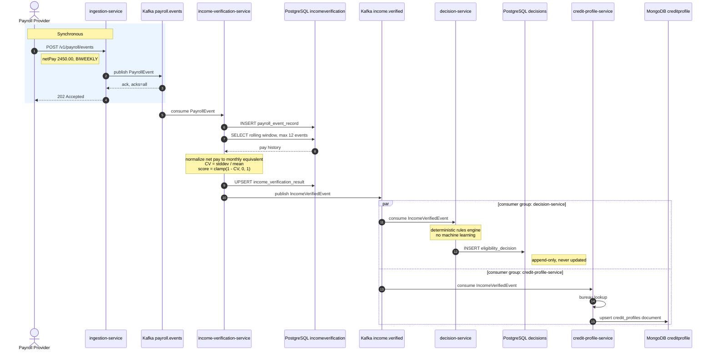
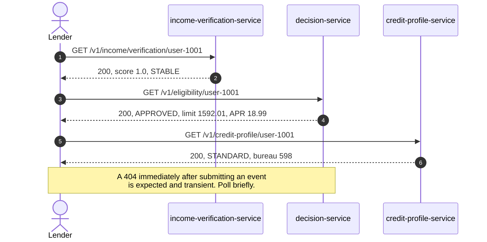
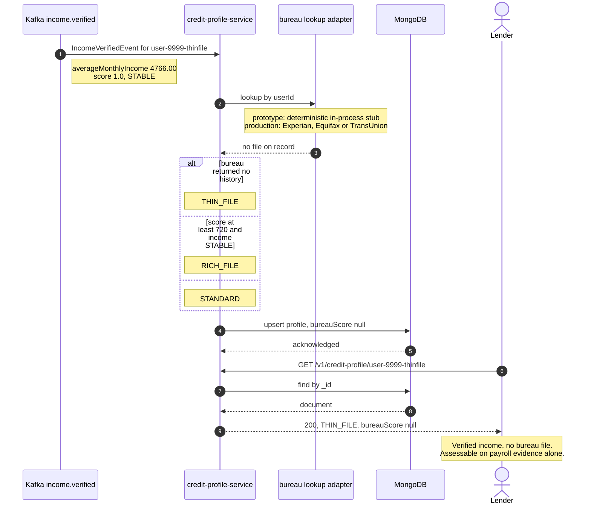
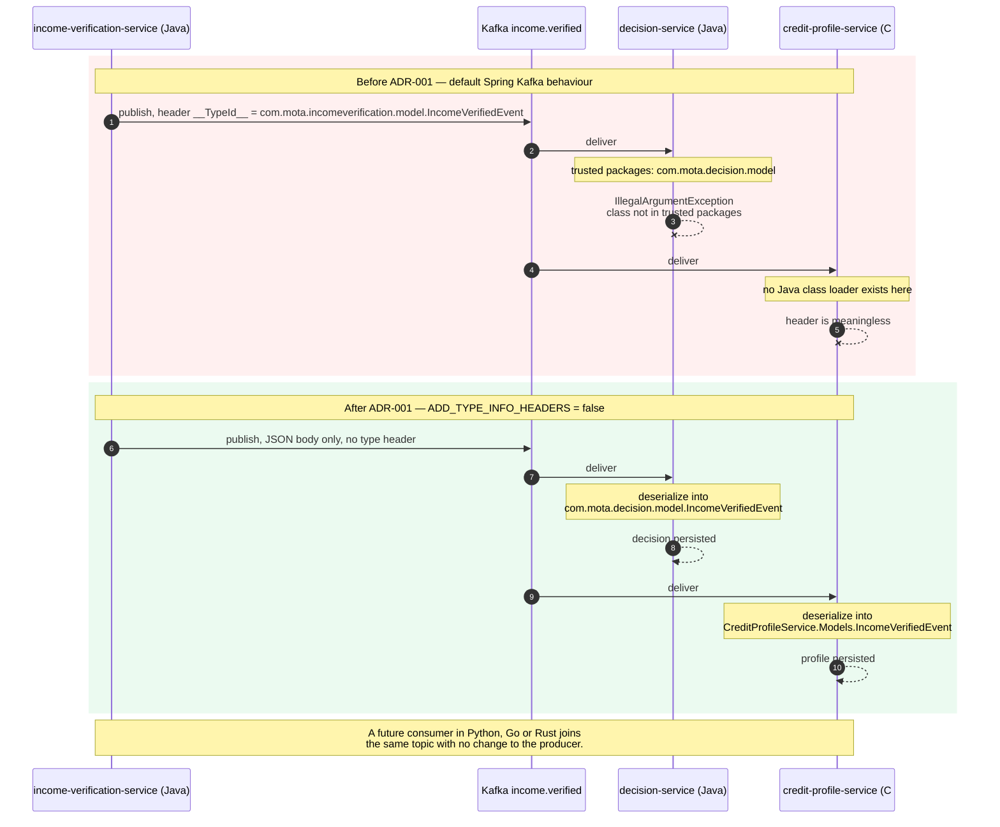
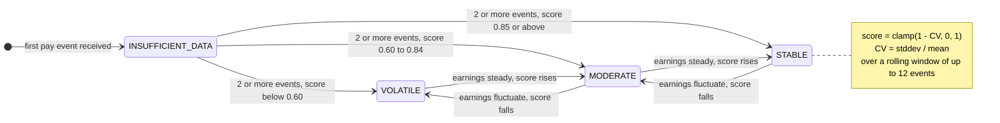
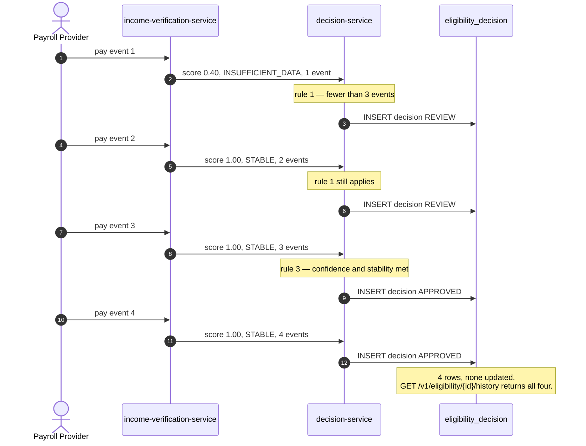
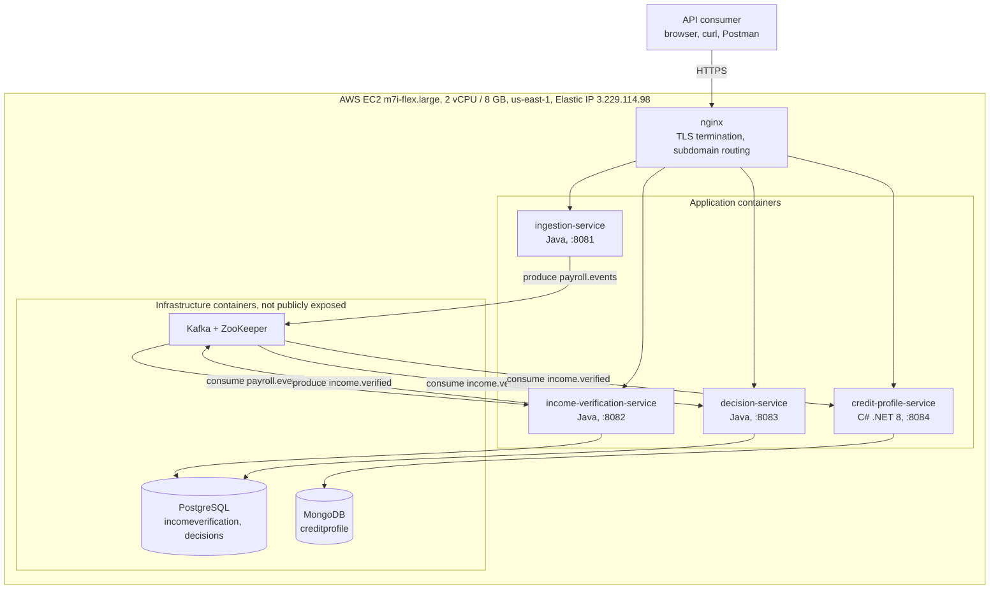

# Processing Flows

Sequence and structural diagrams for the Payroll-Integrated Real-Time Credit
Infrastructure.

These diagrams are written in [Mermaid](https://mermaid.js.org) and render
directly in GitHub. They are text, not images, so they are version-controlled
alongside the code and cannot silently drift out of date the way an exported
PNG can.

They complement rather than replace the architecture overview in
`docs/architecture-v4.png`: that diagram shows *what the system is made of*,
while these show *what happens over time* when it runs.

| # | Diagram | Question it answers |
|---|---|---|
| 1 | [End-to-end processing flow](#1--end-to-end-processing-flow) | What happens between a payroll event arriving and a credit decision existing? |
| 2 | [Thin-file classification](#2--thin-file-classification) | How does a worker with no bureau history get assessed? |
| 3 | [Cross-language fan-out](#3--cross-language-fan-out) | How can a C# service and a Java service consume the same event? |
| 4 | [Assessment evolution](#4--assessment-evolution-and-the-audit-trail) | How does confidence build as pay history accumulates? |
| 5 | [Deployment topology](#5--deployment-topology) | What actually runs where? |

---

## 1 — End-to-end processing flow

The core path. A payroll provider submits one pay period; the platform
normalizes it, recomputes the worker's income confidence score, and fans the
result out to two independent consumers that produce an eligibility decision
and an aggregate credit profile.

The synchronous portion ends at step 4. Everything after that is asynchronous:
the caller has already received its response and the pipeline continues in the
background.



Reading the results is an ordinary synchronous query against whichever service
owns the answer:



---

## 2 — Thin-file classification

The financial inclusion case, and the reason the platform exists.

A worker with verified, stable payroll income but no credit bureau file is
invisible to conventional underwriting — there is no score to decline them on,
so they are declined for absence of data. This flow shows how the platform
identifies that population as a distinct, assessable segment rather than
discarding it.

Any `userId` ending in `-thinfile` deterministically produces this path in the
prototype, so the case can be demonstrated on demand.



---

## 3 — Cross-language fan-out

Three services in this platform are Java on Spring Boot; the credit profile
service is C# on .NET 8. They consume the same Kafka topic, in independent
consumer groups, with no shared library and no generated stubs between them.

That interoperability is not automatic. Spring Kafka's `JsonSerializer` emits
a `__TypeId__` header naming the *producer's* Java class, and a consumer
configured with `JsonDeserializer` will refuse any class outside its trusted
package list. The result is that a service in a different package — let alone
a different language — cannot deserialize the message at all.

ADR-001 resolves this by requiring every producer to set
`ADD_TYPE_INFO_HEADERS = false`. The event schema becomes the contract; the
producing class name becomes an implementation detail.



The trade-off is deliberate: consumers must know their target type at compile
time, since there is no type resolution from headers. In a system where each
service owns its own data transfer objects, that is the desired property — it
forces explicit awareness of the contract rather than implicit coupling to
another service's internals.

---

## 4 — Assessment evolution and the audit trail

A worker's assessment is not a single computation. It is recomputed on every
incoming pay event, and each recomputation appends a new immutable decision
record. The history is therefore a complete account of how the platform's view
of that worker changed as evidence accumulated.

The stability label follows from the confidence score and the number of events
on record:



Each recomputation produces a new decision. Nothing is overwritten:



This matters for two reasons beyond good practice. Regulation B requires that
a declined consumer receive the specific principal reason for the decision, so
the `reasoning` recorded alongside each outcome must be the one that actually
applied at that moment. And Basel II model risk management requires that a
model's output be independently reproducible — which is only meaningful if the
inputs that produced it were retained.

---

## 5 — Deployment topology

What physically runs, and where. The entire platform currently occupies a
single EC2 instance; this is a deliberate choice for the prototype phase,
maximising reproducibility and ease of inspection at the cost of availability.



Four subdomains resolve to the same Elastic IP and are separated by nginx
virtual host:

| Subdomain | Container port |
|---|---|
| `ingestion.payroll-credit.com` | 8081 |
| `income.payroll-credit.com` | 8082 |
| `decision.payroll-credit.com` | 8083 |
| `creditprofile.payroll-credit.com` | 8084 |

Kafka, ZooKeeper, PostgreSQL and MongoDB have no published ports on the
security group. They are reachable only from within the Docker network.

The scaling path out of this topology — partition count, managed data
services, replica counts — is set out in section 11 of the System Architecture
Document.

---

## Static exports

GitHub renders the blocks above natively, so no build step is needed for
normal use. Static PNG exports are kept in [`rendered/`](rendered/) for the
contexts where Mermaid cannot render — PDF submissions, slide decks, printed
material.

| File | Diagram |
|---|---|
| [`01-end-to-end-processing-flow.png`](rendered/01-end-to-end-processing-flow.png) | End-to-end processing flow |
| [`02-reading-results.png`](rendered/02-reading-results.png) | Reading results |
| [`03-thin-file-classification.png`](rendered/03-thin-file-classification.png) | Thin-file classification |
| [`04-cross-language-fanout.png`](rendered/04-cross-language-fanout.png) | Cross-language fan-out |
| [`05-income-stability-states.png`](rendered/05-income-stability-states.png) | Income stability state transitions |
| [`06-audit-trail-accumulation.png`](rendered/06-audit-trail-accumulation.png) | Audit trail accumulation |
| [`07-deployment-topology.png`](rendered/07-deployment-topology.png) | Deployment topology |

To regenerate them after editing this file:

```bash
./render.sh
```

The script splits each fenced `mermaid` block out of this document and renders
it with the Mermaid CLI, installing the CLI on first run if it is absent. The
`NAMES` array inside the script must stay in the same order as the blocks
here; the script fails loudly if the counts diverge.
